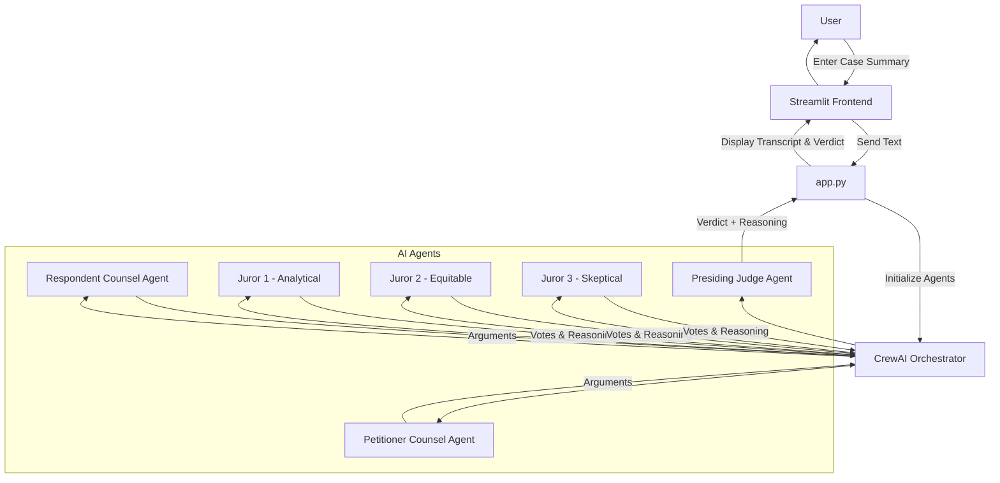

# Agent of Justice ⚖️

An AI-powered Supreme Court case simulation. Select or paste a case summary and watch AI agents simulate:

- **Opening Arguments** (Petitioner vs Respondent)
- **Jury Deliberation** (3 diverse jurors)
- **Final Verdict** (Presiding Judge)

Built with **CrewAI**, **Groq** (Llama models), and **Streamlit**.

## Live Demo

[https://agents-of-justice.streamlit.app/](https://agents-of-justice.streamlit.app/)

## System Architecture



## Features

- Clean courtroom transcript
- Three pre-loaded landmark Indian Supreme Court cases
- Realistic multi-agent legal reasoning
- Responsive Streamlit interface

## How the Agents Work

1. **Opening Arguments**  
   - Presiding Judge moderates  
   - Petitioner & Respondent Counsel argue both sides

2. **Jury Deliberation**  
   - Juror #1 (Analytical) – focuses on logic & precedent  
   - Juror #2 (Equitable) – emphasizes fairness & impact  
   - Juror #3 (Skeptical) – challenges assumptions  
   → Debate → Vote → Majority decision

3. **Final Verdict**  
   - Presiding Judge reviews arguments + jury outcome and delivers reasoned judgment with operative order

All reasoning is based solely on the provided case text.

## Tech Stack

- Streamlit – UI & deployment
- CrewAI – Multi-agent orchestration
- Groq – Fast inference (Llama-3.3-70B & Llama-3.1-8B)
- LiteLLM – LLM interface

## Local Installation

```bash
git clone https://github.com/namanshetty25/Agents-Of-Justice.git
cd Agents-Of-Justice

python -m venv venv
source venv/bin/activate  # Windows: venv\Scripts\activate

pip install -r requirements.txt

mkdir .streamlit
echo 'GROQ_API_KEY = "your_key_here"' > .streamlit/secrets.toml

streamlit run app.py
```
